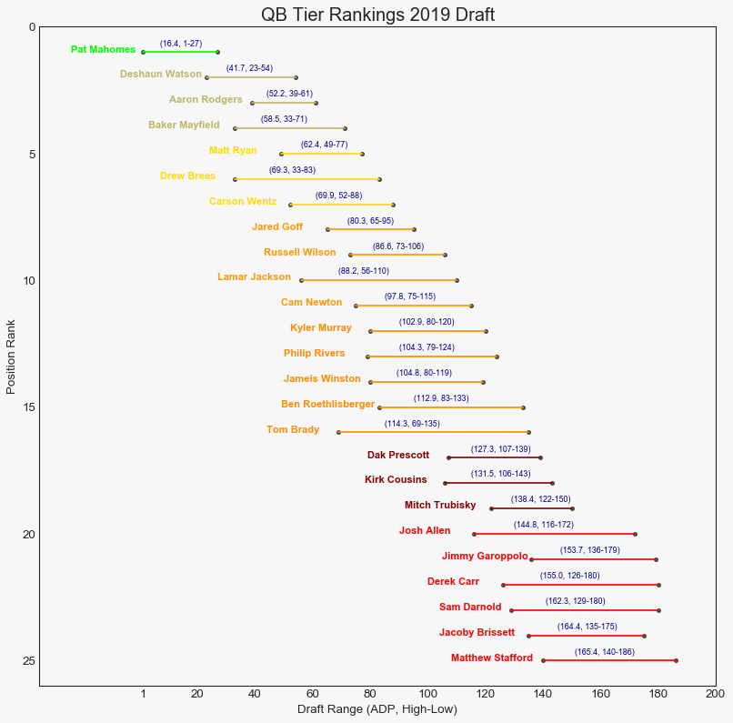
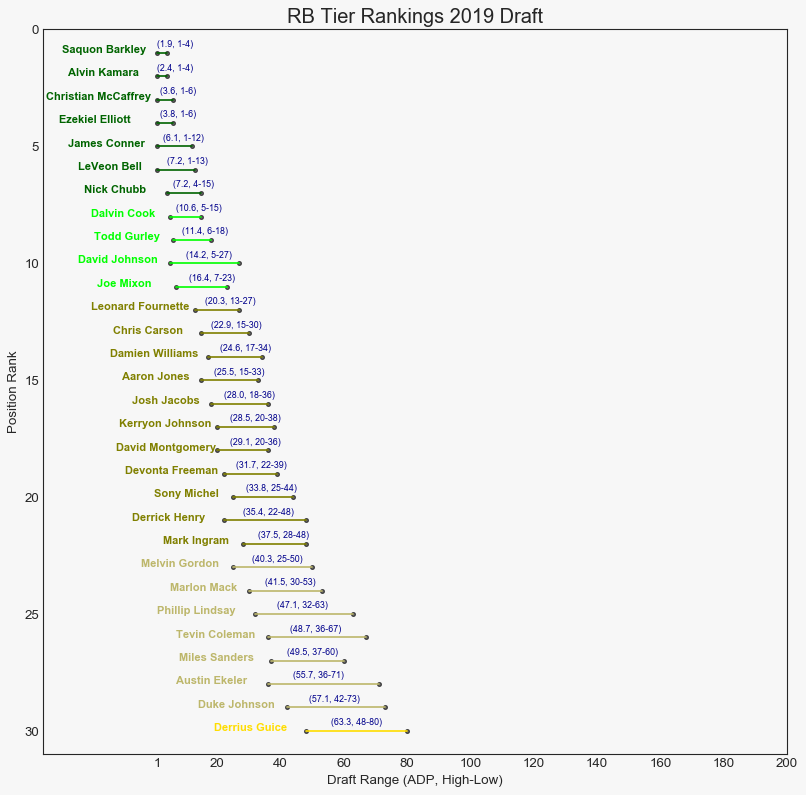
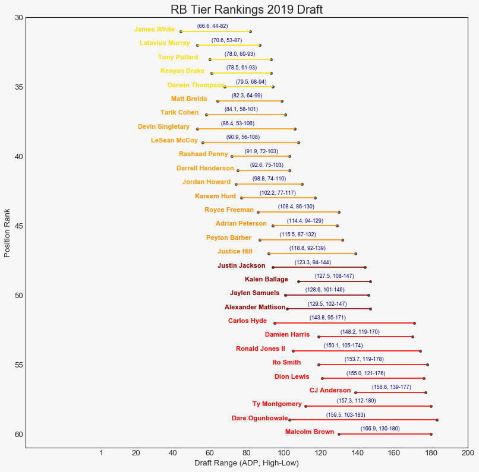
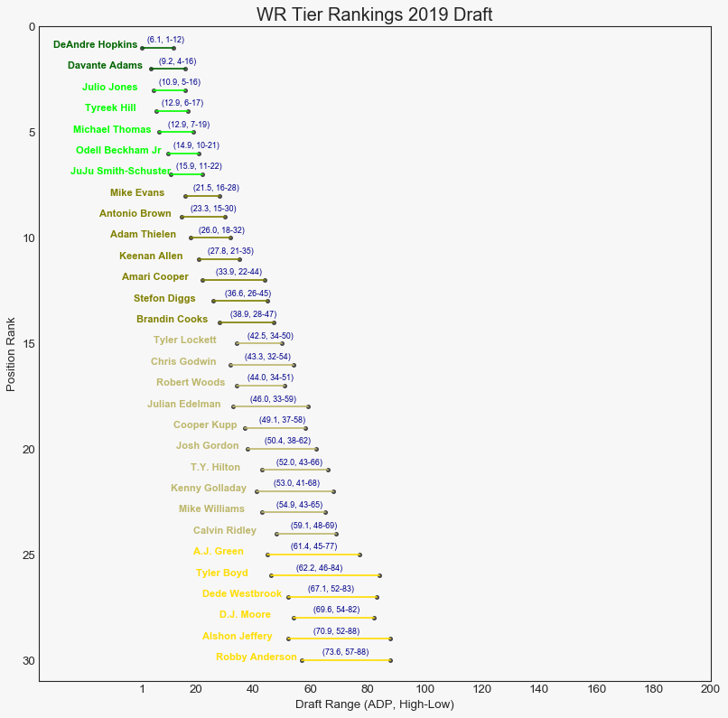
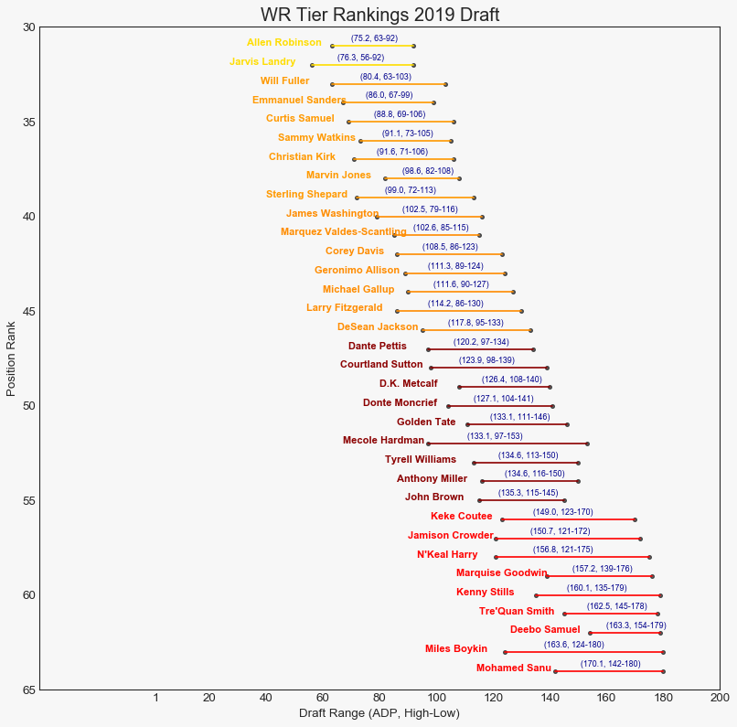
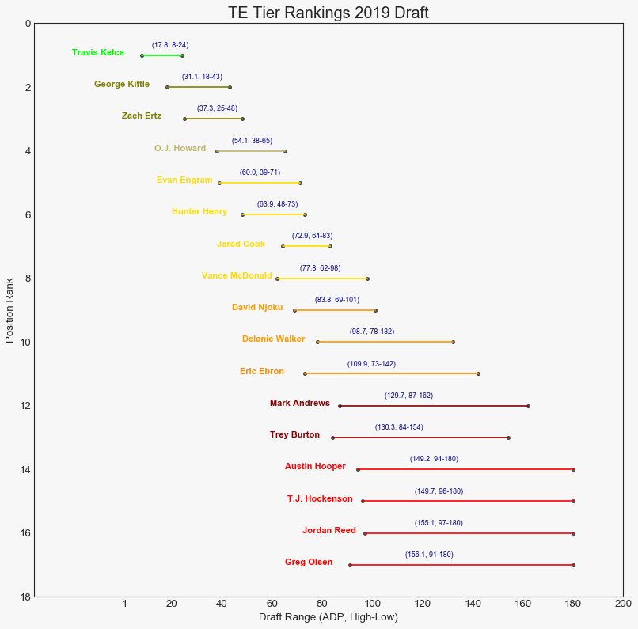

# Fantasy Football Draft Tier Charts by Position

A Python program that uses the Pandas, matplotlib, seaborn and other libraries to create a dumbbell showing important draft information by position. Dependent on data from fantasyfootballcalculator.com's draft API. 

BIG Shoutout to [@nathanbraun](https://github.com/nathanbraun) and his book [Learn to Code with Fantasy Football](https://fantasycoding.com/) serving as inspiration for this project. Also thanks to my professor Kristin Tufte for her support and oversight on this project. 

## Additional Documentation
* [Final Report](https://docs.google.com/document/d/1lN7iKECzaJkH3gpvY5clNCtNwel7trGcqxQdevyN9eU/edit?usp=sharing)
* [Learning Journal](https://docs.google.com/document/d/1J2Bf2THjNF59vVlXhHCIcj3woCYQLhStObwje7wi3mE/edit?usp=sharing)

## Dependencies
Make sure you have python3 and Jupyter installed.  I recommend Anaconda Distribution to manage.  
Note: This is tested on Windows. Mac and Linux will have a slightly different setup.

* [Python3 Installation](https://www.python.org/downloads/)
* [Anaconda Installation](https://www.anaconda.com/distribution/)

## 2019 Draft Tier Charts by Position

* Running Backs 1st Half Tier Rankings

* Running Backs 2nd Half Tier Rankings

* Wide Receivers 1st Half Tier Rankings

* Wide Receivers 2nd Half Tier Rankings

* Tight End Tier Rankings

